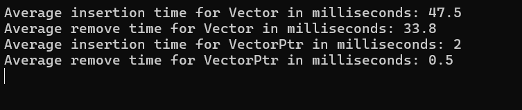

# cpp-project

---

# part1:

# Single Pointer and Double Pointer Vector performance comparison

## Overview

This part compares the performance of two custom vector implementations in C++. The first implementation uses a single pointer for new memory allocation, while the other uses a double pointer. The comparison involves inserting and removing elements using both vector implementations and measuring the time taken for these operations in milliseconds.

## Components

- **`vector.h`** A vector implementation using a single pointer for new memory allocation.
- **`vector2ptr.h`** A vector implementation using a double pointer for new memory allocation.
- **`shape_pt1.h`** Contains a shape class that can allocate a relatively large amount of memory.
- **`main.cpp`** Main file that includes both vector classes and does the performance comparison.

## Details

Both vectors get instantiated with 100 shape objects that each allocate 1 megabyte worth of memory. Then the program performs several insertion operations at the first index(which is the worst case scenario due to shifting) of the vectors. Same process happens with the remove function at index 0(which again is the worst case scenario) and the average insertion and removal times get printed to the console.

## Results:



Double Pointer Vector performs noticably faster than Single Pointer Vector(visual studio code).

## Interpretation

Double Pointer Vector is a vector of addresses pointing toward some objects rather than the objects themselves which is how the Single Pointer Vector operates. This change of design reflects on the time taken to perform an insert and/or remove operation as it only shifts addresses and not actual objects which can be(and in this case "are")quit large to be copied or even be moved.

# part2:

# Calculating physical attributes of nested Device/Shape objects

## Overview

This part tries to model a realistic device object that is made up of both simple objects and more complex device-like objects. The goal is to compute the physical attributes of the main device such as surface area, volume and mass by computing and then adding all of the child devices/shapes attributes.

## Components

- **`poly.h`** Contains a `Poly` class which takes in number of sides and distance from the center to construct a 2D perfect polygonal shape.
- **`shape.h`** Extends 2D `Poly` objects into 3D via a height and a density parameter and calculates their surface area, volume and mass.
- **`device.h`** Uses two vectors of types `Shape` and `Device` to store both shapes and sub-devices. It also utalizes several functions to compute the physical attributes of the main device.

#### Key Functions

- **`double mass()`**

  - Computes the total mass of the device based on shape and device properties.

- **`double volume()`**

  - Computes the total volume of the device based on shape and device properties.

- **`double surface()`**
  - Computes the total surface of the device based on shape and device properties.

## Example Usage

### Creating a 2D Object

```cpp
#include "poly.h"

int main() {
    Poly circle(1);   // creating a 2D object with radius 1
    Poly square(4, 1);   // creating a 2D object with 4 sides and distance from center equal to 1

```

### Creating a 3D Object

```cpp
#include "poly.h"
#include "shape.h"

int main() {
    Poly circle(1);
    Shape cylinder(circle, 2, 3);    // creating a 3D prism object with circle object as base, height of 2 and density of 3
```

### Creating a Device

```cpp
#include <iostream>
#include "poly.h"
#include "shape.h"
#include "device.h"

int main() {
    Poly circle(1);
    Shape cylinder(circle, 2, 3);

    Device d1;    // creating a device object
    Device d2;

    d1.AddShape(cylinder);    // adding a shape object to our sub-device

    d2.AddDevice(d1);    // adding a sub-device to our main device
    d2.AddShape(cylinder);

    std::cout << d2.mass() << std::endl    // printing total mass to console
```

+compiled files for windows are available in the folders
